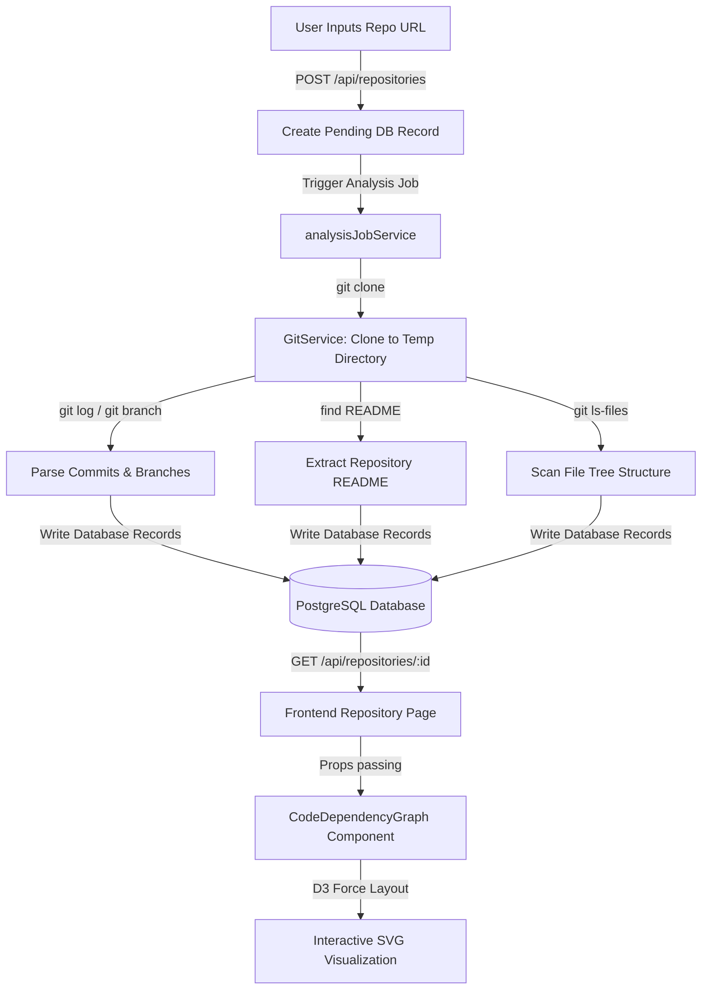

# GitVerse Next.js — Architecture & Engineering Notes

This document provides a technical walkthrough of the GitVerse codebase, capturing system architecture, folder hierarchies, data pipelines, database models, and the D3.js visualization engine.

---

## 1. Directory Structure

The project has been migrated from a Vite-based single-page application to a Next.js 14 App Router codebase.

```
gitverse-nextjs/
├── app/                      # Next.js App Router (Pages & API routes)
│   ├── api/                  # Backend endpoints (Auth, AI, Repositories)
│   │   ├── ai/               # Gemini AI analysis & chat
│   │   ├── repositories/     # Repository CRUD & stats
│   │   └── webhooks/         # GitHub app integrations
│   ├── dashboard/            # User main view
│   ├── repo/                 # Individual repo details & visualizations
│   ├── layout.tsx            # Global layout with providers
│   └── page.tsx              # Home landing page
├── src/
│   ├── components/           # UI Components
│   │   ├── repository/       # File structure, commit graphs, overview
│   │   ├── visualizations/   # D3.js code visualization graphs
│   │   └── ui/               # Core atomic layout components
│   ├── lib/                  # Backend services
│   │   ├── services/         # Business logic (Git, Gemini, DB operations)
│   │   └── prisma.ts         # Global database client singleton
│   ├── hooks/                # Custom React hooks (e.g., auth, query)
│   └── utils/                # General utility functions
├── prisma/
│   └── schema.prisma         # Prisma data models (PostgreSQL)
```

---

## 2. Data Flow: From Repository URL to Interactive Graph

The flow of git data follows a decoupled pipeline from initial import to final D3-rendered node:



1. **Import Route**: [app/api/repositories/route.ts](file:///d:/GitVerse/app/api/repositories/route.ts) receives the POST request, creates a `Repository` record with `"pending"` status, and creates an `AnalysisJob`.
2. **Analysis execution**: [lib/services/repositoryService.ts](file:///d:/GitVerse/lib/services/repositoryService.ts) clones the repository into a temporary OS folder, parses metadata, extracts the README, gets branches, fetches commits up to 1000 entries, scans files, detects languages, and computes contributor percentages. All these are written to PostgreSQL.
3. **API endpoint**: The frontend queries the database and fetches the repository record with its included relations: `branches`, `commits`, `contributors`, `languages`, and the first 500 `files`.
4. **Rendering**: The `CodeDependencyGraph` component processes the files to construct folder and file nodes, laying them out dynamically via D3's force-directed simulator.

---

## 3. Database Schema Overview

The database uses PostgreSQL via Prisma. Key models and relationships defined in [schema.prisma](file:///d:/GitVerse/prisma/schema.prisma) include:

- **User**: Core profile containing authentication data, connected accounts, and weekly configurations.
- **Repository**: Individual repository containing size, description, stars, forks, default branch, status (`pending`, `analyzing`, `completed`, `failed`), and relationships.
- **Branch**: Unique branches belonging to a repository, tracking commit counts and protection.
- **Commit**: Commit history containing author details, timestamps, branch references, and arrays for parents/refs/tags.
- **File**: Tracks repository file paths, sizes, extensions, lines, and detected languages.
- **FileChange**: Links file modifications (additions, deletions, changeType) to specific commits.
- **Contributor**: Individual committers and their total changes (lines added, deleted, percentage of total project commits).
- **Language**: Language name and byte counts inside the repository.

---

## 4. D3 Visualization Engine Details

The repository's core interactive visualization is rendered inside [CodeDependencyGraph.tsx](file:///d:/GitVerse/src/components/visualizations/CodeDependencyGraph.tsx):

- **Graph Structure Construction**:
  - Folders are extracted from file paths (e.g. `src/components/button.tsx` yields folder nodes for `src` and `src/components`).
  - File nodes are limited to the top 30 files by line count to prevent browser lagging.
  - File-to-folder and folder-to-folder parent/child links are automatically established.
- **Force Simulation**:
  - Uses `d3.forceSimulation(nodes)` to calculate continuous node positioning.
  - Employs `d3.forceLink(links)` to pull connected nodes together.
  - Employs `d3.forceManyBody().strength(-300)` for repulsion to keep the graph spread out.
  - Employs `d3.forceCollide()` to prevent overlapping circles.
- **Interactions**:
  - **Drag**: Uses `d3.drag()` to allow manual repositioning of nodes.
  - **Zoom/Pan**: Uses `d3.zoom()` with scale boundaries `[0.5, 3]`.
  - **Hover**: Circles scale up and highlight connected edges by changing line opacity and stroke color dynamically. A floating HTML tooltip follows the cursor.
  - **Load animation**: A transition expands circle radii from `0` to target size on mount.

---

## 5. Planned Visualization Enhancements

The visualization system will be upgraded through subsequent phases:
- **Responsive Improvements (Phase 3)**: Fix viewport scaling on mobile screens and handle overflow containers.
- **Advanced Graph Elements (Phase 4)**: Build glow filters, pulse animations for central/important nodes, and animated edge traces.
- **Onboarding Journey (Phase 5)**: Implement step-by-step repository onboarding flows highlighting entrance files (e.g., config files, entry scripts).
- **Cinematic Experience (Phase 6)**: Implement a particle backdrop, custom camera focus zooms, and a constellation/galaxy universe layout.
- **Performance (Phase 7)**: Utilize canvas rendering or WebGL if file nodes scale beyond 100 files, and memoize calculations to avoid React re-render lag.
